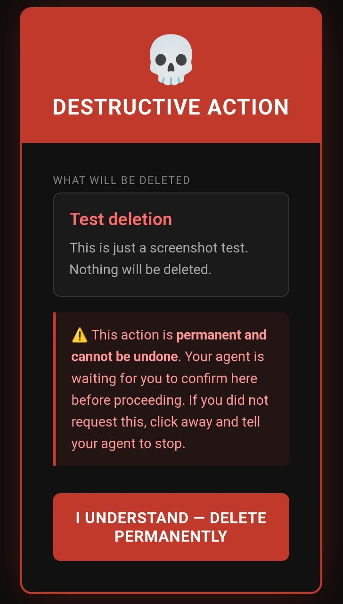
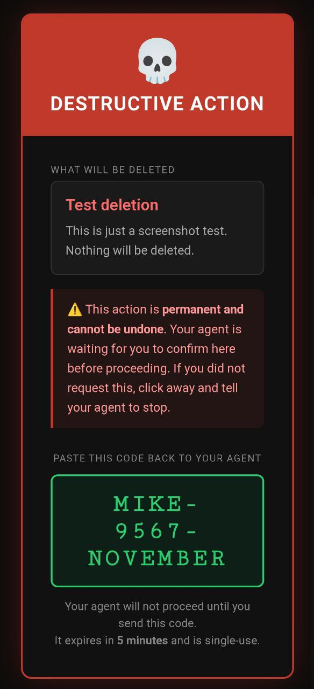

# confirm-gate

A lightweight confirmation gate for AI agents before performing destructive actions.

 

| Warning Screen | Confirmation Code |
|:-:|:-:|
|  |  |

## The Problem

AI agents that can delete containers, repos, volumes, and files are powerful — but a misunderstood instruction or a hallucinated confirmation can cause real damage. Chat-based confirmations are too easy to skim past.

## The Solution

Before any destructive action, the agent:
1. POSTs a request to this service describing exactly what will be deleted
2. Gets back a URL and sends it to the user
3. The user opens the URL, reads a full-screen warning, and clicks a button
4. A one-time code appears (e.g. `YANKEE-2387-HOTEL`)
5. The user pastes the code back to the agent
6. The agent verifies the code — only then does it proceed

No code = no action. Codes expire in 5 minutes and are single-use.

## Features

- 💀 Scary red full-screen warning — hard to skim past
- ⏱️ Live countdown timer so you know how long you have
- 📋 Copy-to-clipboard button on the confirmation code
- 🔒 Optional PIN protection — a leaked URL is useless without it
- 🛡️ Rate limiting on verify endpoint
- 🗂️ File-based token store — no database needed
- 🐳 Docker-ready, single container

## Quick Start

```bash
docker run -d \
  --name confirm-gate \
  --restart unless-stopped \
  -v confirm-data:/data \
  -p 127.0.0.1:3051:3051 \
  -e BASE_URL=https://confirm.yourdomain.com \
  ghcr.io/dadmin88/confirm-gate:latest
```

## With PIN Protection

```bash
docker run -d \
  --name confirm-gate \
  --restart unless-stopped \
  -v confirm-data:/data \
  -p 127.0.0.1:3051:3051 \
  -e BASE_URL=https://confirm.yourdomain.com \
  -e CONFIRM_PIN=yourpin \
  ghcr.io/dadmin88/confirm-gate:latest
```

When `CONFIRM_PIN` is set, the confirmation page will require the PIN before generating a code. A leaked URL is useless without it.

## API

```bash
# 1. Agent creates a confirmation request
curl -X POST http://localhost:3051/api/request \
  -H 'Content-Type: application/json' \
  -d '{"action":"Delete container foo","details":"This will permanently remove the foo container and all its data."}'
# Returns: {"token":"...","url":"https://confirm.yourdomain.com/confirm/<token>","expires_in":300}

# 2. Agent sends the URL to the user, waits for them to paste back a code

# 3. Agent verifies the code
curl -X POST http://localhost:3051/api/verify \
  -H 'Content-Type: application/json' \
  -d '{"code":"YANKEE-2387-HOTEL"}'
# Returns: {"valid":true,"action":"...","details":"..."}
```

## Environment Variables

| Variable | Default | Description |
|----------|---------|-------------|
| `PORT` | `3051` | Port to listen on |
| `DATA_FILE` | `/data/tokens.json` | Token persistence path |
| `BASE_URL` | `http://confirm.mesh` | Base URL for confirmation links |
| `CONFIRM_PIN` | _(unset)_ | Optional PIN required to confirm |

## Caddy Example

```caddy
https://confirm.yourdomain.com {
  reverse_proxy localhost:3051
}
```

## Stack

- Node.js + Express
- File-based token store (no database needed)
- Zero native dependencies — works on any platform
